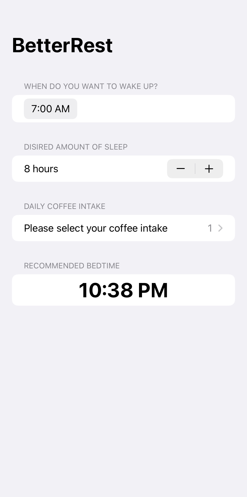

### About The Project

This app is to help coffee drinkers get a good night’s sleep.

It will ask users three questions:

1. When do they want to wake up?
2. Roughly how many hours of sleep do they want?
3. How many cups of coffee do they drink per day?

And this app will use a trained machine learning model to predict when they ought to go to bed.

 

### Built With

- [SwiftUI](https://developer.apple.com/xcode/swiftui/)